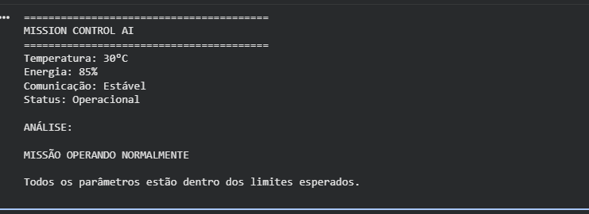
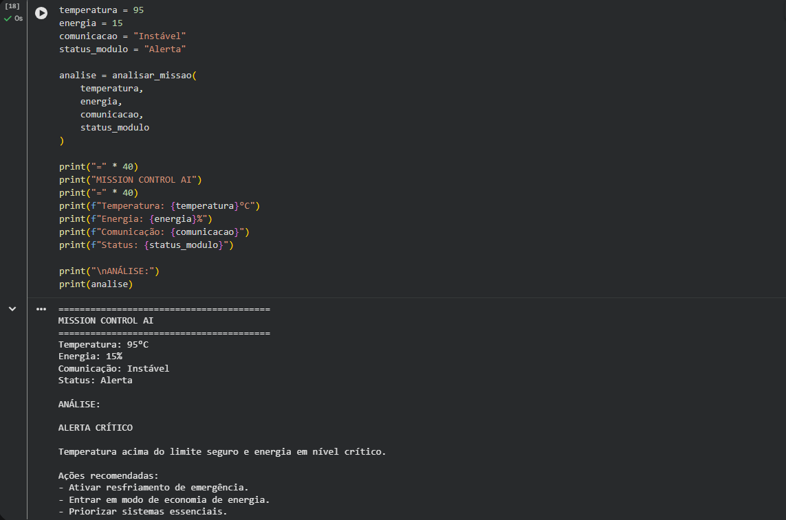

# Mission Control AI

## Integrantes

* João Augusto Poloniato Telles – RM: 571443
* Lais da Silva Dias – RM: 569943

## Descrição do Projeto

Este projeto foi desenvolvido para a Global Solution 2026.1 da disciplina Prompt and Artificial Intelligence. O sistema simula o monitoramento de uma missão espacial por meio da análise de temperatura, energia, comunicação e status dos módulos.

O sistema monitora parâmetros como temperatura, nível de energia, comunicação e status dos módulos. Quando algum parâmetro apresenta valores críticos, o sistema gera alertas e recomendações para auxiliar no monitoramento da missão.
## Tecnologias Utilizadas

* Python
* Google Colab
* GitHub

## Demonstração

### Cenário Normal

O sistema monitora os parâmetros da missão e identifica que todos os valores estão dentro dos limites operacionais esperados.

### Cenário Crítico

O sistema detecta temperatura elevada, baixo nível de energia e instabilidade na comunicação, gerando alertas e recomendações automáticas para auxiliar a equipe de monitoramento.

## Como Executar

1. Abra o notebook no Google Colab.
2. Execute as células em ordem.
3. Observe os dados simulados e os alertas gerados pelo sistema.

## Vídeo de Demonstração

Link do vídeo: https://youtu.be/WfIMjoxV_aw
